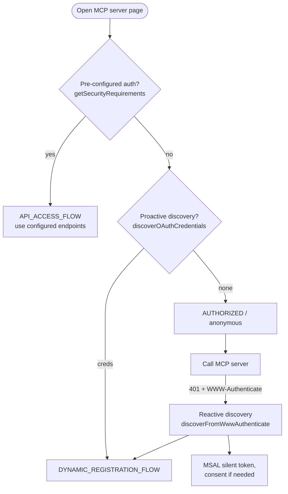
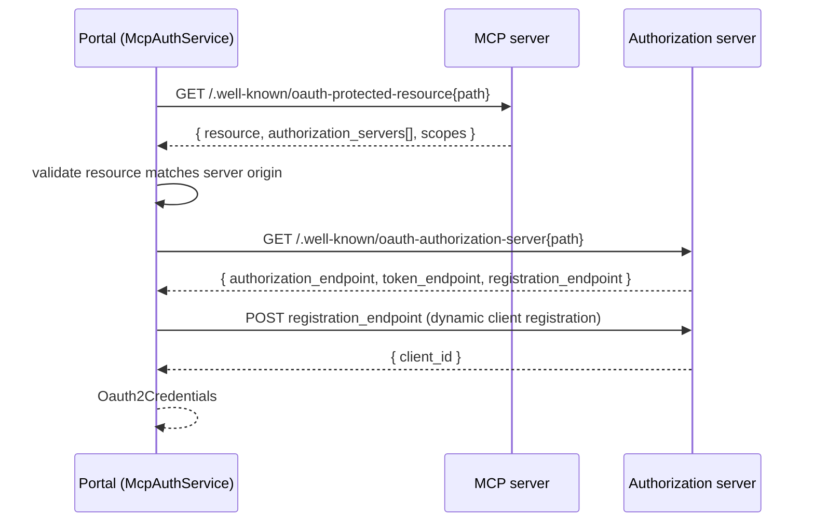

# MCP OAuth Resolution

How the Developer Portal decides which OAuth credentials to use when a user opens an
MCP server's documentation/test page, and how it discovers those credentials when they
are not pre-configured.

## Overview

An MCP server exposed through API Center can require OAuth. The portal obtains the
credentials it needs (`clientId`, `authorizationUrl`, `tokenUrl`, scopes, flows) from one
of two sources:

| Source | Origin | Read by |
|---|---|---|
| **A — Pre-configured** | "API access" auth configured on the API in API Center (RP `securityRequirements` / `:getCredentials`) | `ApiService.getSecurityRequirements` / `getSecurityCredentials` |
| **B — Discovered** | The MCP server and its authorization server, via `.well-known/*` metadata (RFC 9728 + RFC 8414) | `McpAuthService.discoverOAuthCredentials` (proactive) and `McpAuthService.discoverFromWwwAuthenticate` (reactive) |

**Source A is authoritative.** It already carries the exact endpoints, so no metadata
discovery is performed when it is present. Discovery (Source B) exists only to derive those
values when they are not configured.

## Resolution order

`McpSpecPage.determineAuthFlow` selects the flow when the page loads. Pre-configured auth is
checked first; discovery is a fallback; anonymous is the default.

- **Ref:** `src/pages/ApiSpec/McpSpecPage/McpSpecPage.tsx:49` (`determineAuthFlow`);
  `:56` (`getSecurityRequirements`), `:64` (`discoverOAuthCredentials`).
- The reactive branch runs during the actual MCP call: a `401` carrying a
  `WWW-Authenticate` header triggers RFC 9728 discovery.
  **Ref:** `src/pages/ApiSpec/McpSpecPage/McpSpecPage.tsx:106`–`108`.

## Discovery (Source B)

Both discovery entry points converge on the same chain: **protected-resource metadata
(RFC 9728) → authorization-server metadata (RFC 8414) → dynamic client registration**.

- **Proactive** (`discoverOAuthCredentials`, `src/services/McpAuthService.ts:252`): runs
  eagerly from the server URI. It is path-aware — it does **not** reduce the URI to its
  origin.
- **Reactive** (`discoverFromWwwAuthenticate`, `src/services/McpAuthService.ts:292`): runs
  after a `401`, taking the `resource_metadata` URL directly from the `WWW-Authenticate`
  header (`parseWwwAuthenticate`, `:20`). When the authorization server does not support
  dynamic registration, it falls back to an MSAL/Entra consent flow.

### Well-known URL construction

The two RFCs place the `.well-known` segment differently. Getting this wrong sends token
requests to a nonexistent endpoint (404), so the placement rules are implemented explicitly.

| Metadata | RFC | Placement for a path-bearing base | Example |
|---|---|---|---|
| Protected resource | 9728 | insert before path, **root fallback** | `host/.well-known/oauth-protected-resource/myapi/mcp` → `host/.well-known/oauth-protected-resource` |
| Authorization server | 8414 §3.1 | insert before path | `host/.well-known/oauth-authorization-server/tenant1` |
| Authorization server (OIDC) | — | insert before path, then appended fallback | `host/.well-known/openid-configuration/tenant1` → `host/tenant1/.well-known/openid-configuration` (Entra) |

`authServerMetadataCandidates` tries the RFC 8414 inserted form first, then the OIDC
metadata inserted form, then — only when the issuer has a path — the appended OIDC form for
Microsoft Entra compatibility (duplicates are removed). The candidate lists are produced by
small pure helpers and tried in order until one returns a document; every candidate is
checked by `validateMetadataUrl` (HTTPS-only; rejects credentials, fragments, and hostnames
that are literal loopback/link-local/private-range addresses — defense-in-depth for the
server-side proxy path) before it is fetched.

- Protected-resource candidates: `protectedResourceMetadataCandidates`,
  `src/services/McpAuthService.ts:126`.
- Authorization-server candidates: `authServerMetadataCandidates`,
  `src/services/McpAuthService.ts:159`; consumed by `fetchAuthServerMetadata`, `:176`.
- `validateMetadataUrl`, `:53`; `validateResourceMetadata` (resource ↔ server origin),
  `:108`; `registerClient` (dynamic registration), `:202`.

## Auth states

`McpSpecPage` renders based on `McpServerAuthState`
(`src/pages/ApiSpec/McpSpecPage/McpSpecPage.tsx`):

- `API_ACCESS_FLOW` — pre-configured auth; renders the API access form.
- `DYNAMIC_REGISTRATION_FLOW` — discovered OAuth with dynamic client registration.
- `MSAL_CONSENT_NEEDED` — discovered Entra-backed auth requiring interactive consent.
- `AUTHORIZED` — anonymous, or a token already acquired.

Token acquisition for the discovered/configured OAuth flows is dispatched by
`OAuthService.authenticate` (`src/services/OAuthService.ts:87`); the authorization-code/PKCE
path POSTs to `credentials.tokenUrl` (`src/services/OAuthService.ts:181`) — the endpoint that
must be resolved correctly by the rules above.

## Code map

| Concern | Location |
|---|---|
| Flow selection / ordering | `src/pages/ApiSpec/McpSpecPage/McpSpecPage.tsx:49` |
| Reactive 401 handling | `src/pages/ApiSpec/McpSpecPage/McpSpecPage.tsx:106` |
| Proactive discovery | `src/services/McpAuthService.ts:252` |
| Reactive discovery | `src/services/McpAuthService.ts:292` |
| Protected-resource URL rules (RFC 9728) | `src/services/McpAuthService.ts:126` |
| Auth-server URL rules (RFC 8414) | `src/services/McpAuthService.ts:159` |
| URL / resource validation | `src/services/McpAuthService.ts:53`, `:108` |
| Dynamic client registration | `src/services/McpAuthService.ts:202` |
| Token acquisition | `src/services/OAuthService.ts:87` |

## Related

- [Authentication Architecture](authentication.md) — portal-level MSAL / anonymous modes.
- RFC 8414 (Authorization Server Metadata), RFC 9728 (Protected Resource Metadata).
